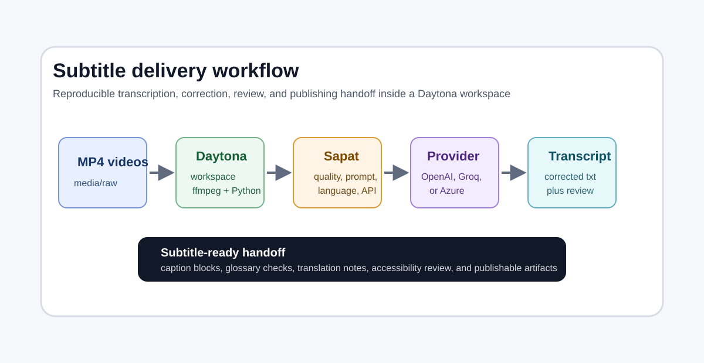

# Build Subtitle-Ready Transcripts with Sapat

# Introduction

Video archives become much more useful when every recording has a clean transcript, a subtitle file, and a clear review trail. Meeting recordings, product walkthroughs, community calls, course videos, and customer demos all contain information that teams need later.

The hard part is not only turning speech into text. The hard part is making the workflow repeatable enough that another engineer can open the same repository, run the same commands, and produce handoff-ready artifacts without guessing which provider, prompt, language setting, or correction step was used.

This guide shows how to use [Sapat](https://github.com/nkkko/sapat), a Python command-line transcription tool, inside a [Daytona workspace](/definitions/20240819_definition_daytona%20workspace.md).

Sapat converts video files to MP3 with `ffmpeg`, sends the audio to OpenAI, Groq, or Azure OpenAI, optionally runs a correction pass, and writes a `.txt` transcript beside the source video.

We will turn that into a practical subtitle delivery workflow for AI engineers: one workspace, one media folder, repeatable provider configuration, transcript review, subtitle segmentation, and a publishing checklist.

The emphasis here is different from a basic "run a transcription command" tutorial. By the end, you will have a workspace pattern that supports multilingual videos, subtitle-ready text, review notes, and clean artifacts that can be handed to content, education, or accessibility teams.



## TL;DR

- Use Daytona to create a reproducible workspace for Sapat instead of configuring transcription tools directly on your laptop.
- Configure one or more providers: OpenAI, Groq, or Azure OpenAI.
- Use Sapat's `--language`, `--prompt`, `--temperature`, `--quality`, `--correct`, and `--api` flags to make transcription runs predictable.
- Convert raw `.txt` transcripts into subtitle-ready review files with speaker, glossary, timing, and publishing notes.
- Keep input videos, generated transcripts, subtitle drafts, and reviewer notes in separate folders so the workflow can be repeated safely.

## What You Will Build

The final workspace will have a simple structure:

```text
sapat-subtitle-workflow/
  .devcontainer/
    devcontainer.json
  media/
    raw/
    transcripts/
    subtitles/
    review/
  prompts/
    glossary.txt
    subtitle-correction.md
  README.md
```

Sapat writes transcripts next to the input video by default. The folder layout above gives you a controlled place to move each output after every run.

That matters when a directory contains several `.mp4` files and you want to avoid mixing raw media, generated text, reviewer changes, and publishable drafts.

## How Sapat Provider Support Is Organized

Sapat keeps provider integrations small and easy to inspect. The CLI entrypoint
is `src/sapat/script.py`, and each transcription backend lives in
`src/sapat/transcription`.

At the time of writing, Sapat includes providers for OpenAI, Groq, and Azure
OpenAI. Each provider implements the same base shape:

- Read provider-specific credentials and model names from `.env`.
- Validate or prepare the converted audio file.
- Send the MP3 file to the provider's speech-to-text endpoint.
- Return either JSON or text that Sapat can save as a `.txt` transcript.
- Optionally use a chat model to run a correction pass.

That structure is useful when you want to add another speech-to-text API later.
A new provider should follow the existing `TranscriptionBase` contract, add its
environment variables to `.env.example`, and then register a new `--api` choice
in the CLI.

For a subtitle workflow, the important provider capability to look for is not
only transcription quality. Check whether the provider can return timestamps,
word-level metadata, stable language controls, and a predictable response
format. Those features decide how much manual work remains between a raw
transcript and a timed subtitle file.

## Prerequisites

Before starting, make sure you have:

- [Daytona](https://www.daytona.io/docs/installation/installation/) installed.
- Docker running locally or available through your Daytona target.
- A GitHub account for creating a small workflow repository.
- Python 3.6 or newer in the workspace.
- `ffmpeg` available in the workspace.
- API credentials for at least one supported provider: OpenAI, Groq, or Azure OpenAI.
- One or more `.mp4` files that you are allowed to process.

You do not need every provider. Pick the one that matches your budget, quality target, and compliance requirements.

## Step 1: Create a Workspace Repository

Create a new repository for the workflow. You can keep it private if your videos or transcripts are sensitive.

```bash
mkdir sapat-subtitle-workflow
cd sapat-subtitle-workflow
git init
mkdir -p .devcontainer media/raw media/transcripts media/subtitles media/review prompts
```

Add a `.devcontainer/devcontainer.json` file so Daytona can open the same environment every time:

```json
{
  "name": "sapat-subtitle-workflow",
  "image": "mcr.microsoft.com/devcontainers/python:1-3.11-bullseye",
  "features": {},
  "postCreateCommand": "sudo apt-get update && sudo apt-get install -y ffmpeg && python -m pip install --upgrade pip && pip install git+https://github.com/nkkko/sapat.git",
  "customizations": {
    "vscode": {
      "extensions": [
        "ms-python.python"
      ]
    }
  }
}
```

Commit the initial workspace files:

```bash
git add .
git commit -m "Create Sapat subtitle workflow workspace"
```

Then create the Daytona workspace from the repository:

```bash
daytona create https://github.com/YOUR_USERNAME/sapat-subtitle-workflow --code
```

Daytona opens the repository in a clean development environment. The `postCreateCommand` installs `ffmpeg` and Sapat so teammates do not need to repeat the same setup manually.

## Step 2: Add Provider Credentials

Sapat reads provider settings from a `.env` file. Create one in the workspace root:

```bash
touch .env
```

For OpenAI, add:

```bash
OPENAI_API_KEY=your_openai_key
OPENAI_MODEL=whisper-1
OPENAI_API_ENDPOINT=https://api.openai.com/v1/audio/transcriptions
OPENAI_MODEL_NAME_CHAT=gpt-4o
```

For Groq, add:

```bash
GROQCLOUD_API_KEY=your_groq_key
GROQCLOUD_MODEL=whisper-large-v3-turbo
GROQCLOUD_API_ENDPOINT=https://api.groq.com/openai/v1/audio/transcriptions
GROQCLOUD_MODEL_NAME_CHAT=llama3-8b-8192
```

For Azure OpenAI, add:

```bash
AZURE_OPENAI_API_KEY=your_azure_key
AZURE_OPENAI_ENDPOINT=https://DEPLOYMENTENDPOINTNAME.openai.azure.com
AZURE_OPENAI_DEPLOYMENT_NAME_WHISPER=whisper
AZURE_OPENAI_API_VERSION_WHISPER=2024-06-01
AZURE_OPENAI_DEPLOYMENT_NAME_CHAT=gpt-4o
AZURE_OPENAI_API_VERSION_CHAT=2023-03-15-preview
```

Add `.env` to `.gitignore`:

```bash
echo ".env" >> .gitignore
```

Keep provider credentials out of Git. For shared workspaces, store the expected variable names in `.env.example` and keep actual keys in your secret manager.

## Step 3: Prepare Media and Prompt Files

Copy a video into `media/raw`:

```bash
cp ~/Downloads/product-demo-spanish.mp4 media/raw/
```

Create a glossary file. This helps keep product names, project names, speaker names, and acronyms consistent.

```bash
cat > prompts/glossary.txt <<'EOF'
Daytona
Sapat
dev container
workspace
subtitle
accessibility
EOF
```

Create a correction prompt:

```bash
cat > prompts/subtitle-correction.md <<'EOF'
Correct spelling, capitalization, punctuation, and obvious transcription mistakes.
Preserve the speaker's meaning.
Keep product names from the glossary exact.
Do not summarize.
Prefer short sentences that can be split into subtitles.
EOF
```

Sapat accepts `--prompt` as a text string, so for a short run you can paste a compact version of this prompt directly into the command. Keeping the longer prompt in a file is still useful because it documents the editorial rule set used by the team.

## Step 4: Run Your First Transcription

Run Sapat on a single video:

```bash
sapat media/raw/product-demo-spanish.mp4 \
  --api groq \
  --quality H \
  --language es \
  --prompt "Product demo with Daytona, Sapat, workspaces, dev containers, and subtitles." \
  --temperature 0.2 \
  --correct
```

Here is what each option does:

| Option | Why it matters |
| --- | --- |
| `--api groq` | Selects the provider. Sapat also supports `openai` and `azure`. |
| `--quality H` | Converts the video to higher-quality MP3 audio before transcription. |
| `--language es` | Tells the transcription model the expected speech language. |
| `--prompt` | Biases the model toward your vocabulary and domain words. |
| `--temperature 0.2` | Keeps output more deterministic than a higher-temperature run. |
| `--correct` | Runs a correction pass after transcription. |

Sapat creates `media/raw/product-demo-spanish.txt`. Move it into the transcript folder:

```bash
mv media/raw/product-demo-spanish.txt media/transcripts/product-demo-spanish.transcript.txt
```

Sapat also creates a temporary MP3 file during processing and deletes it after the transcript is saved. That keeps the workspace clean and avoids accidentally committing derived audio.

## Step 5: Process a Batch of Videos

If you pass a directory, Sapat processes every `.mp4` file in that directory:

```bash
sapat media/raw \
  --api openai \
  --quality M \
  --language en \
  --prompt "Engineering demo with terminal commands, Daytona workspaces, Sapat transcription, and subtitles." \
  --temperature 0 \
  --correct
```

After the run, move outputs into the transcript folder:

```bash
for file in media/raw/*.txt; do
  name="$(basename "$file" .txt)"
  mv "$file" "media/transcripts/${name}.transcript.txt"
done
```

For repeatable production work, run batches by language or content type. Mixing English webinars, Spanish demos, and noisy customer calls in one run makes troubleshooting harder. Separate runs let you tune `--language`, `--prompt`, and `--quality` without losing track of what produced each transcript.

## Step 6: Convert the Transcript into a Subtitle Draft

Sapat currently writes plain `.txt` transcripts, not `.srt` or `.vtt` subtitle files. Treat its output as the first stage of the subtitle workflow. The next stage is segmentation.

Create a subtitle draft file:

```bash
cp media/transcripts/product-demo-spanish.transcript.txt \
  media/subtitles/product-demo-spanish.subtitle-draft.md
```

Open the draft and split long paragraphs into short caption blocks. A practical first pass is:

- One idea per caption.
- One or two lines per caption.
- Fewer than 42 characters per line when possible.
- Avoid splitting names, commands, or URLs across captions.
- Keep reading speed comfortable for the target audience.

Example:

```text
[00:00:04.000 --> 00:00:08.500]
Welcome to this Daytona workspace.
We will transcribe a product demo with Sapat.

[00:00:08.500 --> 00:00:13.000]
The workspace keeps ffmpeg, Python,
and provider credentials isolated.
```

If the model did not return timestamps, estimate timestamps during review or run a separate alignment tool later. The important thing at this stage is to produce subtitle-ready text that is short, readable, and easy to align.

## Step 7: Add a Review Checklist

Create a review note beside each subtitle draft:

```bash
cat > media/review/product-demo-spanish.review.md <<'EOF'
# Review notes: product-demo-spanish

## Source

- Video: media/raw/product-demo-spanish.mp4
- Transcript: media/transcripts/product-demo-spanish.transcript.txt
- Subtitle draft: media/subtitles/product-demo-spanish.subtitle-draft.md
- Provider: Groq
- Language: es
- Quality: H
- Correction: enabled

## Checks

- [ ] Product names match glossary
- [ ] Speaker names are correct
- [ ] Commands and file paths are correct
- [ ] Captions are short enough to read
- [ ] No private information remains
- [ ] Captions are ready for timing alignment
EOF
```

This looks simple, but it is the difference between "we generated text" and "we can publish this safely." Review notes also make the workflow auditable. If a teammate asks why one video used Groq and another used Azure OpenAI, the answer is in the artifact folder.

## Step 8: Translate or Localize Carefully

For multilingual publishing, do not translate raw transcripts blindly. First produce the clean source-language transcript, then translate the reviewed subtitle draft. This avoids multiplying transcription errors across languages.

A safe sequence is:

1. Transcribe with the correct source language.
2. Correct terms using the glossary.
3. Segment into subtitle-ready blocks.
4. Review the source-language draft.
5. Translate the reviewed blocks.
6. Review the translated version with a native speaker or domain reviewer.

Store translations beside the source draft:

```text
media/subtitles/
  product-demo-spanish.subtitle-draft.es.md
  product-demo-spanish.subtitle-draft.en.md
```

When you translate, keep the caption block boundaries stable unless the target language needs a different reading rhythm. This makes it easier to reuse timing data.

## Step 9: Troubleshooting

**Problem:** `ffmpeg` is not found.

**Solution:** Confirm the workspace installed it:

```bash
ffmpeg -version
```

If it is missing, install it in the dev container:

```bash
sudo apt-get update
sudo apt-get install -y ffmpeg
```

Then add that installation command to `.devcontainer/devcontainer.json` so the fix persists.

**Problem:** Sapat says the provider credentials are missing.

**Solution:** Check that `.env` is in the workspace root and uses the exact variable names expected by Sapat. For example, Groq requires `GROQCLOUD_API_KEY`, `GROQCLOUD_MODEL`, `GROQCLOUD_API_ENDPOINT`, and `GROQCLOUD_MODEL_NAME_CHAT`.

**Problem:** The transcript contains product-name mistakes.

**Solution:** Add the correct names to your `--prompt` and to `prompts/glossary.txt`. Re-run with `--correct`, then compare the corrected transcript against the original.

**Problem:** Large files fail.

**Solution:** The OpenAI and Groq implementations in Sapat validate audio file size against a 25 MB limit after conversion. Lower the MP3 quality with `--quality M` or `--quality L`, split the source video, or process shorter clips.

**Problem:** Directory processing skips files.

**Solution:** Sapat's directory mode processes `.mp4` files. Convert or rename other video formats before the batch run, or process them one by one after converting to `.mp4`.

## Step 10: Publishing Handoff

Before handing the files to a publishing team, commit only the workflow files and non-sensitive notes. Avoid committing proprietary video files or transcripts unless the repository is private and approved for that content.

Use this final handoff checklist:

- `media/raw` contains only approved source videos.
- `media/transcripts` contains raw or corrected `.txt` outputs.
- `media/subtitles` contains subtitle-ready drafts split into readable blocks.
- `media/review` records provider, language, quality, and correction settings.
- `.env` is ignored.
- `.env.example` documents required provider variables.
- The glossary is updated with product and speaker names.

The result is a reusable transcription pipeline rather than a one-off AI run. Daytona provides the stable workspace, Sapat handles provider-backed transcription, and your review folders turn generated text into publishable subtitle assets.

## Conclusion

Sapat is a small tool, but it becomes much more useful when you put it inside a reproducible Daytona workflow. The CLI gives you practical controls over provider choice, language, prompt, temperature, audio quality, directory processing, and correction.

Daytona makes those controls repeatable for every teammate who opens the workspace.

For AI engineers, this pattern is a solid base for accessibility and content pipelines. Start with one video, review the transcript carefully, split it into subtitle-ready blocks, and preserve the run details.

Once that works, batch the same workflow across demos, lectures, product videos, and multilingual publishing queues.

## References

- [Sapat GitHub repository](https://github.com/nkkko/sapat)
- [Daytona documentation](https://www.daytona.io/docs)
- [OpenAI audio transcription API](https://platform.openai.com/docs/guides/speech-to-text)
- [Groq audio transcription docs](https://console.groq.com/docs/speech-to-text)
- [Azure OpenAI audio concepts](https://learn.microsoft.com/azure/ai-services/openai/)
